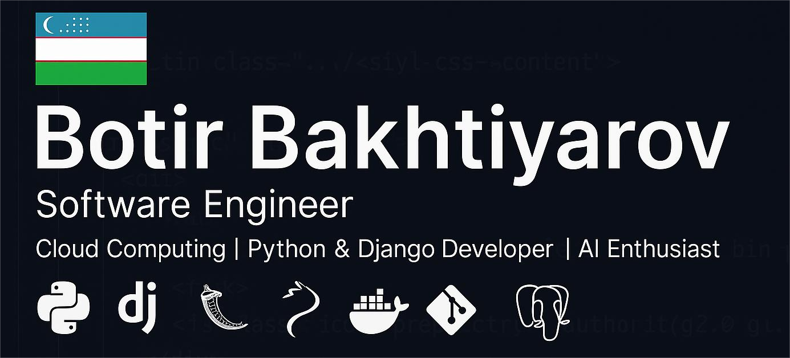

  
#  Botir Bakhtiyarov 
### _Software Engineer • Cloud Architect • AI Explorer_
  

  
📍 **Based in** Kunming, China | 🏢 **Working at** 工一(云南)数字科技有限公司  
🌐 **Polyglot**: Uzbek | Chinese | English  
💡 **Passionate About**: AI Integration • Cloud Solutions • Developer Education
  

---

## 🛠️ Technical Arsenal

### 🔮 Core Competencies
**Backend Development** • **Cloud Architecture** • **AI/ML Integration** • **System Automation**

### 🧩 Tech Stack

| Category        | Technologies                                                                                                                                                                                                                                                                                                                                                                                                                                                                        |
|-----------------|-------------------------------------------------------------------------------------------------------------------------------------------------------------------------------------------------------------------------------------------------------------------------------------------------------------------------------------------------------------------------------------------------------------------------------------------------------------------------------------|
| **Languages**   |                                                                                                                                                                                                       |
| **Frameworks**  |                                                                                                                                                                                                           |
| **Cloud & Dev** |       |
| **AI Tools**    |                                                                                                                                                                                    |
| **Others**|      

---

## 🏆 Featured Projects

### 🤖 AI-Powered Solutions

> AI-driven static analysis for security & performance optimization

> Automated PDF analysis with AI content detection

> Automatically analyze the data using AI (powered by DeepSeek)

### ☁️ Cloud & Automation

> Enterprise software deployment system

> Advanced search with OCR & semantic analysis

---

## 📈 GitHub Analytics

  
| **Metric**           | **Stats**                                                                 |
|----------------------|---------------------------------------------------------------------------|
| Contribution Streak  | <picture> <source media="(prefers-color-scheme: dark)" srcset="https://streak-stats.demolab.com?user=BotirBakhtiyarov&theme=dark"> <source media="(prefers-color-scheme: light)" srcset="https://streak-stats.demolab.com?user=BotirBakhtiyarov&theme=light">  </picture> |
| Activity Breakdown   | <picture> <source media="(prefers-color-scheme: dark)" srcset="https://github-readme-stats.vercel.app/api?username=BotirBakhtiyarov&show_icons=true&theme=dark&count_private=true"> <source media="(prefers-color-scheme: light)" srcset="https://github-readme-stats.vercel.app/api?username=BotirBakhtiyarov&show_icons=true&theme=default&count_private=true">  </picture>  <picture> <source media="(prefers-color-scheme: dark)" srcset="https://github-readme-stats.vercel.app/api/top-langs/?username=BotirBakhtiyarov&layout=compact&theme=dark"> <source media="(prefers-color-scheme: light)" srcset="https://github-readme-stats.vercel.app/api/top-langs/?username=BotirBakhtiyarov&layout=compact&theme=default">  </picture> |
| Achievement Showcase | <picture> <source media="(prefers-color-scheme: dark)" srcset="https://github-profile-trophy.vercel.app/?username=BotirBakhtiyarov&theme=onedark&no-frame=true&row=1&column=7"> <source media="(prefers-color-scheme: light)" srcset="https://github-profile-trophy.vercel.app/?username=BotirBakhtiyarov&theme=onelight&no-frame=true&row=1&column=7">  </picture> |

---

## 🌐 Digital Footprint

---

  
<picture>
  <source media="(prefers-color-scheme: dark)" srcset="https://raw.githubusercontent.com/BotirBakhtiyarov/BotirBakhtiyarov/output/github-snake-dark.svg" />
  <source media="(prefers-color-scheme: light)" srcset="https://raw.githubusercontent.com/BotirBakhtiyarov/BotirBakhtiyarov/output/github-snake.svg" />
  
</picture>

**Let's Build the Future Together**  
💌 Reach me at: botirbakhtiyarovb@gmail.com

