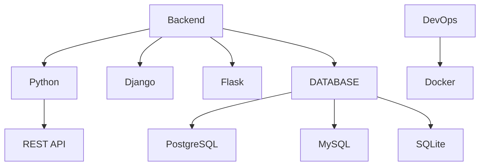

# 👋 Hi, I'm Botir Bakhtiyarov

Welcome to my GitHub! I'm a **Software Engineer** based in Kunming, China. I specialize in backend development, cloud computing, and web development, and I'm passionate about sharing knowledge in technology and programming.

## 🚀 About Me

- 🌍 **Location:** Kunming, China
- 📚 **Education:** Bachelor's in Computer Science at Kunming University of Science and Technology (4th Year)
- 💼 **Current Role:** Software Engineer at 工一(云南)数字科技有限公司.
- 🎥 **Content Creator:** Sharing tech tutorials, vlogs, and tips on YouTube and Instagram
- 🌐 **Languages:** Fluent in Uzbek, Chinese, and English

## 💻 Tech Stack

- **Programming Languages:** Python
- **Web Development:** Flask, Django, HTML, CSS, JavaScript
- **Databases:** SQLite, PostgreSQL, MySQL
- **Cloud & Virtualization:** Docker, Docker Compose, Clonezilla, Virtual Ubuntu environments
- **Tools:** Git, Visual Studio Code, Postman, Adobe Photoshop

## 🛠 Tech Stack:

## 🔧 Projects

### 1. **[AutoInstaller](https://github.com/BotirBakhtiyarov/AutoInstaller_django)**  
   A Django-based platform where users can register, download, and install applications tailored to their needs, with user profiles and email verification. (In Progress)

### 2. **Virtual Cloud-Based Windows Service**  
   A Windows virtual cloud computing service that provides universities, schools, and colleges with accessible virtual desktops, complete with an app store for optimized educational use.

### 3. **YouTube Assistant**  
   Built using Streamlit and LangChain, this assistant helps users quickly find and organize content on YouTube.

## 📺 Find Me On

- **Instagram:** [@botir.bakhtiyarov](https://www.instagram.com/botir.bakhtiyarov/)  
- **YouTube:** [Botir Bakhtiyarov](https://www.youtube.com/@botirbakhtiyarov)  
- **LinkedIn:** [LinkedIn Profile](https://www.linkedin.com/in/botir-bakhtiyarov-856a83243)  
- **Telegram:** [@BakhtiyarovBotir](https://t.me/BakhtiyarovBotir)

## 💬 Let's Connect

I'm always open to discussions about tech, cloud computing, and content creation. Feel free to reach out through any of the platforms above or via email: **botirbakhtiyarovb@gmail.com**.

<!--
**BotirBakhtiyarov/BotirBakhtiyarov** is a ✨ _special_ ✨ repository because its `README.md` (this file) appears on your GitHub profile.

Here are some ideas to get you started:

- 🔭 I’m currently working on ...
- 🌱 I’m currently learning ...
- 👯 I’m looking to collaborate on ...
- 🤔 I’m looking for help with ...
- 💬 Ask me about ...
- 📫 How to reach me: ...
- 😄 Pronouns: ...
- ⚡ Fun fact: ...
-->
